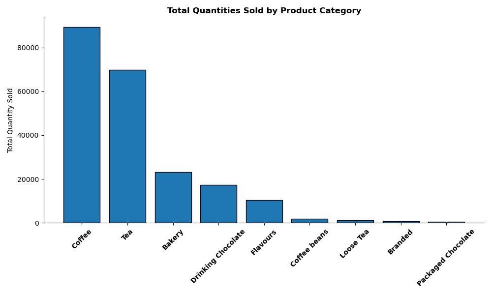

# Introduction
This project analyzes sales trends over a six-month period between January and June 2023, for Maven Roasters Coffee Company, a fictitious coffee shop operating out of three NYC locations. The analysis includes the following: the overall performance of sales for all three stores in daily and weekly intervals, as well as hourly sales trends, top selling product categories in terms of both quantity and transactions sales, top and bottom 10 revenue-making product types in terms of both quantity and transaction sales, and comparisons between the three stores based on overall sales during the six-month period, total quantity and transaction sales. 
# Background
### Data Source: https://www.kaggle.com/datasets/ahmedabbas757/coffee-sales
### Data Background: https://mavenanalytics.io/project/10009
The decision to perform analysis on this type of business domain was inspired by my personal love for coffee. I have also worked briefly at a coffee shop years ago, so I am somewhat familiar with the daily operations of the business. I am interested in applying the data analytics process to dig deeper into the business and hopefully acquire meaningful insights. The main objective I derived my analytical questions from is how the coffee shop can improve its operations and sales. By framing my questions from this goal, I can develop straightforward investigations into how well the business is doing given the timeframe of the data and suggest some strategies.

**Business Objective: How Can Maven Roasters improve operations and sales?**

Analytical Questions:
1. *How have overall coffee shop sales trended over time?*

2. *Which product categories and types have the most/least quantities sold?*
    - *Is there a clear relationship between unit price and transaction quantity?*

3. *Which product categories and types have driven the most revenue for the business?*
    - *Is there a clear relationship between unit price and transaction sales?*

4. *Which store locations generated the most and least revenue for the business?*

***By analyzing these, management can acquire insights that will help with developing strategies to boost business operations and sales.***

**Additional Section: Implementing an ARIMA Model to forecast the next 30-day transaction sales.**
# Tools Used
- **Python:** Entire project is done with Python programming with these libraries:
    - **Pandas:** Used for data manipulation and transformation.
    - **Numpy:** Used in combination with Pandas for preprocessing data.
    - **Matplotlib + Seaborn:** Used for visualizations.
    - **Statsmodels:** Used for time-decomposition and ARIMA forecast modeling.
# Analysis
### (View Entire Project Code: [Maven Roasters Analysis Python Notebook](Maven_Roasters_Co_Sales_Analysis.ipynb))
## 1. How have overall coffee shop sales trended over time?

*Time-series line plot for visualizing total daily sales for all locations during the given time period.*

*Time-series line plot for visualizing total weekly sales for all locations during the given time period.*

*Time-decomposition model display the separate the time series data into these constituent elements, making it easier to understand and forecast future data points. Purpose is to identify trend, spot seasonality and evaluate residuals*

*Line plot to display the hourly sales trend during daily operations*.
### Findings & Observations:
Daily Sales Data:
- There are highs and lows in sales during each week
- The highs seem to happen during the beginning of each week
- The low points seem to happen towards the end of the weeks
- There's a steady overall trend of sales increasing from January to June; decrease happens towards end of June coming into July
- Sales may be decreasing after June because it's the start of summer
- People are less likely to buy coffee items because of the weather and maybe prefer establishments mainly selling cold drinks

Weekly Sales Data:
- Weekly data also shows some peaks and lows during the weeks within each month in the data
- Goes up during first weeks, peaks happens during the middle weeks of each month, goes down towards the end of each month
-There's a steady overall trend of sales increasing from January to June; decrease happens towards end of June coming into July
- Sales may be decreasing after June because it's the start of summer
- People are less likely to buy hot coffee because of the weather and maybe prefer establishments mainly selling cold drinks
  
Daily Sales Time-Decomposition:
- Decomposing the data shows the same pattern of highs and lows
- Highs are usually during the beginning of the weeks; Lows are towards the end of the weeks
- Trend shows a general increase and starts decreasing end of June
- Residuals or the noise indicate no bias or clear pattern

Hourly Trends:
- Overall average sales increase in the morning starting at 8am and the goes down after 10am, but increases after 4pm
- People typically buy coffee in the morning hours, but other sales such as bakery items or tea may be more popular towards end of day
- Total sales do show that sales increase in the morning hours and generally starts to decrease after around 10am
## 2. Which product categories and types have the most/least quantities sold?

*Vertical bar chart to visualize the total quantities sold for each product category.*

*Horizontal bar chart to visualize the top 10 product types with the **most** quantities sold.*

*Horizontal bar chart to visualize the bottom 10 product types with the **least** quantities sold*

### Accompanying Question: Is there a clear relationship between unit price and transaction sales?

*Scatter Regression plot to visualize the relationship between **unit price and transaction quantity sold**.*

#### Findings & Observations:
Product Categories:
- Coffee items are of course the top selling category as it is the core of the business
- Followed by tea which is an alternative beverage people commonly choose besides coffee
- Bakery items is third which is sensible because people pair them with the top two beverage items

Top 10 Product Types:
- Green bar chart for top products shows the best selling items
- Surprisingly brewed chai tea is at the top just closely followed by gourmet brewed coffee for this span of time
- Top 10 comprises of mostly coffee and tea items, which reflects the top selling categories

Bottom 10 Product Types:
- Horizontal red bar chart shows least selling items
- Types are evenly spread between certain teas, coffee beans, merchandise and chocolate
- Might help the business to consider discontinuing some of these types to save costs

Regression Plot Unit Price vs. Transaction Quantity
- Regression line shows sort of a negative linear pattern, indicating a seemingly negative relationship between the two variables
- This may indicate that the bigger the unit price, the less quantity people would want to buy to lower their total purchase

## 3. Which product categories and types have driven the most revenue for the business?

*Vertical bar chart to visualize the total sales for each product category.*

*Horizontal bar chart to visualize the top 10 product types with the **highest** sales.*

*Horizontal bar chart to visualize the bottom 10 product types with the **lowest** sales.*

### Accompanying Question: Is there a clear relationship between unit price and transaction sales?

*Scatter Regression plot to visualize the relationship between **unit price and transaction sales**.*

#### Findings & Observations:
Product Categories:
- Coffee items are of course again the category that makes the most revenue as it is the top selling
- Followed by again by tea and bakery items
- The total quantities analyzed above surely reflects the amount of revenue

Top 10 Product Types:
- Blue bar chart for top products shows the types making the most revenue for the business
- For most revenue in types, barista espresso beats brewed chai tea, which is the most selling in quantity
- Top 10 comprises of mostly coffee and tea items, which reflects the top selling and revenue-making categories

Bottom 10 Product Types:
- Horizontal purple bar chart shows the types making the least money for the business
- Types are evenly spread between certain teas, coffee beans, merchandise and chocolate again
- Might help the business to consider discontinuing some of these types to save costs
- Or have promotions to pair them with most popular items at discounted bundle prices to sell more of them

Regression Plot Unit Price vs. Transaction Sales
- Regression line shows sort of a positive linear pattern, indicating a seemingly positive relationship between the two variables
- This may indicate that the bigger the unit price, the more sales the shop makes as it gets multiplied by purchase quantities per transaction

## 4. Which store locations generated the most and least revenue for the business?

*Box-plot to display the distribution of transaction quantities by location.*

*Time-series line plot to visualize weekly sales performance for each location during the given time period*

*Vertical and horizontal bar charts to display the comparison of total quantity sold and total sales between the three locations.*

#### Findings & Observations:
Differences in Transaction Quantities:
- All three stores have the same median quantities sold when it comes to transactions
- Lower Manhattan and Hell's Kitchen locations do have outliers

Weekly Sales Data:
- All three locations mirror the same weekly sales trend as the overall data
- They all generally track same patterns over time
- Hell's Kitchen location has the highest peak in sales that happens in June right before the decrease that happens afterwards going into summer

Comparing Transactions:
- All three are on par when it comes to total quantities sold and sales or revenue
- Hell's Kitchen does lead in both but the differences are very minute considering the scale of the amounts
- Overall, all three seem to perform closely similar in operations and sales

## Additional Section: ARIMA (Autoregressive Integrated Moving Average) for Forecasting Sales

*Time-series forecast plot to display the 30-day sales predictions, labeled in green.*

#### Observation:
- Sales forecast align with the increasing trend in sales following the next month from the last observed data.
- Although forecast follows the general rise in sales trend, the time-decomposition model and historical time-series data show a beginning decline starting in July.
- Due to the nature of the calculations made by the ARIMA model, the predictions will more likely reflect the most recent increasing trend in values.
- However, looking at the purchasing tendencies of coffee shop customers during the summer, there surely will be a decrease in hot-beverages sales due to the hot weather.
- Strategies laid out in the next section can help adapt to the season.
# Strategies
1. **Weekday Sales Optimization:**
    - End-of-Week Specials: Introduce promotions for Thursday and Friday to boost sales during the low points. For example, offer discounts on certain items, "Buy One Get One Free" on select drinks, or loyalty program double points on these days.

    - Early Week Promotions: Capitalize on the high sales at the beginning of the week with limited time offers to maintain momentum, such as a Monday and Tuesday morning combo deal (coffee + pastry).

    - Host Events: Organize small events or workshops (e.g., coffee tasting, barista skills workshops) on slower days (Thursday/Friday) to attract customers.
2. **Monthly Sales Strategies:**
    - Mid-Month Promotions: Recognize the peak in the middle of the month and introduce mid-month specials to capitalize on this trend, such as themed drink specials or limited-edition menu items.

    - Subscription Services: Offer a coffee subscription service that incentivizes end-of-month purchases by providing discounts or perks for committing to a monthly plan.

    - Pre-Paid Cards: Introduce pre-paid cards that offer a bonus amount for purchasing towards the end of the month, encouraging customers to spend during typically slow periods.
3. **Seasonal Adjustments:**
    - Cold Beverage Focus: Expand the menu with a variety of cold drinks (iced coffee, cold brew, smoothies, iced tea) and highlight these options in marketing efforts as the weather warms up.

    - Seasonal Promotions: Create summer-specific promotions, such as "Summer Cool Down" discounts on cold drinks or introducing a "Flavor of the Month" for cold beverages.

    - Comfort Features: Ensure the coffee shop is a comfortable refuge from the heat with adequate air conditioning, shaded outdoor seating, and promotional materials emphasizing the cool and comfortable environment.
4. **Hourly Sales Strategies:**
    - Efficient Service: Streamline operations during peak morning hours (8-10am) to handle high traffic efficiently. This could include optimizing staff schedules, pre-preparing popular items, and offering mobile ordering or pre-ordering options.

    - Morning Combos: Offer breakfast combos that include coffee and a pastry or sandwich at a discount to increase average transaction value.

    - Afternoon Specials: Introduce an "Afternoon Delight" promotion (4-6pm) with discounted bakery items, tea, or specialty coffee as well as bakery plus beverage combos to attract the after-work crowd.
    
5. **Marketing and Communication:**
    - Social Media and Email: Use data-driven insights to tailor social media and email marketing campaigns to promote specific offers and events on slower days and times.

    - Regular Surveys: Conduct regular customer surveys to gather feedback on new promotions, menu items, and overall satisfaction. Use this data to continually refine and improve offerings and customer experience.
6. **Operational Efficiency:**

    - Dynamic Stocking: Adjust inventory levels based on sales trends to reduce waste and ensure popular items are always available. Increase stock of cold drink ingredients during summer and adjust bakery item quantities based on daily and hourly trends.

    - Cross-Training: Cross-train staff to handle multiple roles, ensuring flexibility and efficiency during varying customer traffic.

    - Standard Operating Procedures: Develop and implement standard operating procedures (SOPs) that capture the best practices from each location to ensure consistent service quality and efficiency.

7. **Leverage Data Consistency Across Locations:**
    - Consistent Branding: Ensure that all marketing materials, promotions, and branding are consistent across all locations to build a strong, unified brand identity.

    - Shared Promotions: Implement store-wide promotions and loyalty programs that customers can enjoy at any location, fostering brand loyalty and encouraging repeat visits.
8. **Capitalize on Transaction Trends:**

    - Understand Outliers: Investigate the reasons behind the outlier transactions in these locations. This could be due to large group orders, special events, or specific customer preferences.

    - Targeted Offers: Create targeted promotions that can convert these outliers into regular occurrences, such as group discounts or event catering services.
9. **Low-Selling Product Categories/Types:**

    - Consider Removing from Menu: It might help the business to consider discontinuing low-selling products to save costs.

    - Create Variations of Top-Selling Products: Consider replacing the low-selling products with variations of the top-selling products that have similar features and ingredients for special promotions.

# Closing Remarks
This project provided the opportunity to discover aspects of the business that can aid in gaining a competitive edge and set it apart from others, highlight areas for possible changes or improvements, and enhance my analytical skills in the sales domain. By conducting this analysis, Maven Roasters management may attain helpful ideas to boost operations and sales.